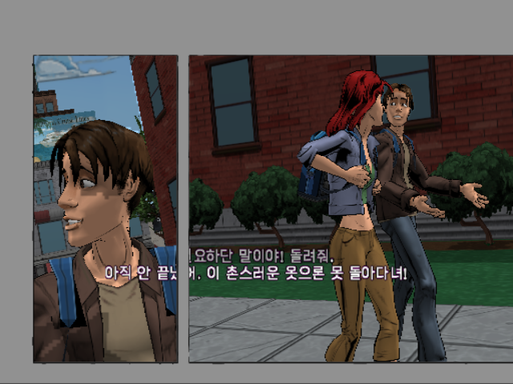
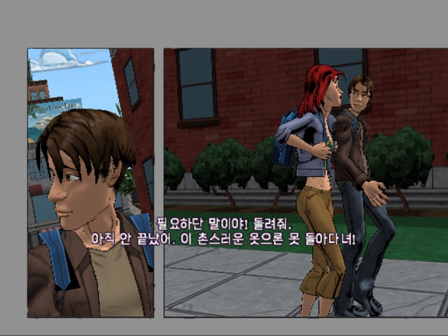
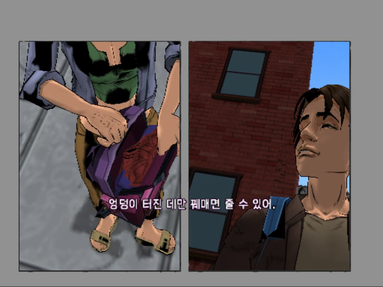
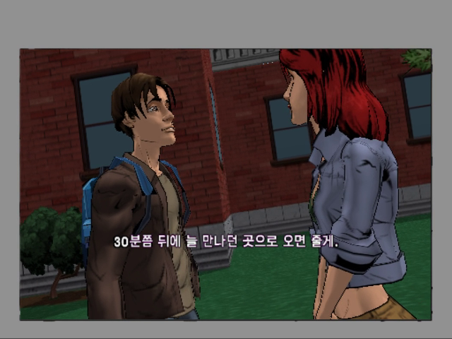

# 분할 연출 자막·음성 동기화 수정

## 원인

v0.9.1-beta는 개별 월드 뷰 렌더링 중 자막 시간을 진행시키고 자막을 그렸습니다. 만화식 분할 연출에서는 뷰가 여러 번 그려지므로 자막 시계가 음성보다 빨라지고, 뒤에 그려지는 패널이 자막을 덮었습니다. 첫 베놈 전투 뒤 피터와 MJ의 장면에서 재현했습니다.

## 수정

ELF 파일 오프셋 0x1786a4의 원래 호출을 복원했습니다. 최종 전체 화면 오버레이의 종료 호출 0x196c0c에 자막 처리를 연결하여 패널 수와 관계없이 한 번 갱신·표시한 뒤 원래 장면 종료 함수를 호출합니다. 기존판과의 실행 파일 차이는 32비트 명령어 4개입니다. 번역·음성·영상 리소스는 이번 수정에서 바뀌지 않았습니다.

## 검증

- PCSX2 v2.9.92에서 전투 직전 QA 상태부터 실제 전투→경찰 연출→MJ 대화→도시 이동을 연속 실행·녹화했습니다. 전투 보조는 별도 QA 상태에만 적용했으며 ISO에는 포함하지 않습니다.
- 기존판 MJ 장면에서 자막 시계 약 9.83초에 실제 음성은 약 6.43초로, 약 3.4초 앞섰습니다.
- 수정판은 전투 전부터 새 코드로 실행했습니다. 자막 시계를 수동 보정하지 않았습니다. 저장 상태의 자막 시계 16.033초와 같은 화면의 녹화 음성 위치 약 16.100초를 대조했습니다. 해당 측정 지점 오차는 약 -0.067초입니다. 영상 프레임 대조는 30fps 기준이므로 모든 대사의 정확도를 보증하는 값은 아닙니다.
- 원본 추출 음원과 수정 전·후 녹화 음성을 상호상관으로 비교했습니다. 검사한 MJ 대사 구간은 순서대로 정상 속도로 진행했습니다. 음성 파일 뒤바뀜이나 반복은 해당 재현 구간에서 확인되지 않았습니다. 측정값은 `validation/`의 두 음성 검사 JSON에 있습니다.
- 2칸·3칸 패널에서 자막 가림이 사라지는 것을 확인했습니다. 타이밍·그리기 호출 위치 검사, 기존 런타임 회귀검사, ISO 보존 검사 및 xdelta 복원 해시 검사를 수행했습니다.
- 모든 후반 연출·전체 게임 진행·실기는 검증하지 않았습니다. ASR 기반 번역의 미검수 문구와 별도 안내문 잘림 검수 과제는 남아 있습니다.

## 비교 화면

수정 전 (자막 일부가 뒤 패널에 가려짐):

수정 후 (분할 패널 위에 전체 문장 표시):

## 적용 주의

원본 일본판 ISO에 새 xdelta를 적용하고 새로 부팅하세요. 이전 세이브스테이트는 옛 실행 코드를 복원하므로 사용하지 마세요. 수정 전후 게임 CRC가 같아 에뮬레이터가 예전 상태를 허용할 수 있습니다. 파일 SHA-256으로 판본을 확인하세요.
